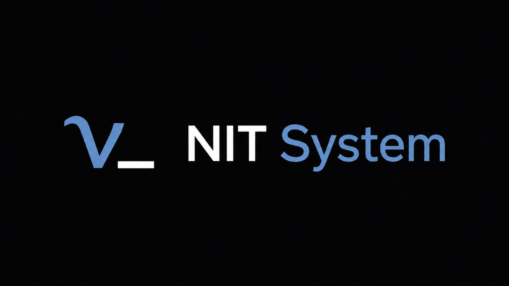

<p align="center">
  
</p>

<h1 align="center">NIT System</h1>

<p align="center">
  
  
  
  
  
  <a href="LICENSE"></a>
  <a href="https://github.com/ART3121/NIT-System/releases/latest"></a>
</p>

NIT System is a fast, local-first notes and task manager for the terminal. It
combines immediate command-line capture, a keyboard-driven TUI, readable IDs,
directory-scoped Plain workspaces, path-independent encrypted Vault workspaces,
and optional local AI Roadmaps.

The name represents the three primary concepts:

- **N**otes
- **I**deas
- **T**o-dos

**Items** are available as an additional entry type for resources and references.

NIT supports ordinary readable `.nit/` files through Plain Storage and optional
authenticated encryption through NIT Vault. NIT Drive keeps a Vault on removable
media and NIT Session shares one unlock locally between processes. No account,
cloud, synchronization service, or network server is required.

## Philosophy

NIT is built around a simple principle: a note system should reduce the distance
between having a thought, preserving it, and finding it again. It provides
enough structure to make entries useful without turning organization into a
separate maintenance project.

- **Capture should become muscle memory.** One short command stores a complete
  entry.
- **Structure should remain lightweight.** Types describe what an entry is;
  horizons describe when an Idea or To-do matters.
- **Commands should not compete with language.** Operations begin with `-`, so
  ordinary words remain valid entry text.
- **Identity should remain human.** Classification-based IDs replace opaque
  random identifiers.
- **Archiving should remain neutral.** Leaving the active view does not impose a
  universal “done” state.
- **Workspace boundaries should follow context.** Directory scope keeps
  unrelated personal and project collections separate.
- **The filesystem is the source of truth.** Plain remains readable and
  manually editable; Vault remains local, portable, versioned, authenticated,
  and encrypted.
- **Optional capabilities must remain optional.** AI, the TUI, Git, and an
  external editor can improve a workflow without becoming prerequisites for
  owning or reading data.

NIT also takes deliberate guidance from the Unix philosophy. The system is
assembled from focused parts: Core owns rules and persistence, CLI owns commands,
TUI owns interactive state, NIT Cat owns reading, and small adapters own Ollama
and editor integration. Components share explicit APIs instead of duplicating
storage logic, while durable state remains in user-owned files rather than
hidden behind a service. The Vault Session Agent retains only an unlocked key
and application state in memory; it is never durable storage and uses no
network.

This is inspiration rather than imitation. A full-screen TUI is not forced into
a stdin/stdout filter, and internal modules exchange typed Rust values instead
of reparsing text at every boundary. NIT adopts responsibility, composition,
observability, and textual ownership from Unix while preserving type safety and
interactive usability.

Read the complete [project philosophy](docs/philosophy.md) and
[architecture rationale](docs/architecture.md).

## Features

- Capture entries without quoting the text.
- Classify Ideas and To-dos by short, medium, or long horizon.
- Keep Notes and Items timeless.
- Address entries with IDs such as `ST-0001`, `LI-0003`, `N-0001`, and `X-0001`.
- Discover the nearest `.nit/` workspace from nested directories.
- Browse, filter, edit, archive, restore, and delete through the TUI.
- Open Notes in a scrollable Markdown reader without leaving the TUI.
- Use the same renderer independently through `nitcat <file.md|NOTE-ID>`.
- Search across titles, Note bodies, IDs, and Roadmaps from the CLI or TUI.
- Grow Notes into individual Markdown documents while keeping other entries compact.
- Wrap long content and scroll collections larger than the terminal.
- Edit Plain entries with Neovim, Vim, Vi, or Nano.
- Import compatible Markdown collections.
- Generate optional Roadmaps through a local Ollama model.
- Store multiple path-independent workspaces in an authenticated Vault.
- Reuse one Vault unlock across CLI, TUI, and desktop clients through local IPC.
- Invalidate a Vault session when its NIT Drive is physically removed.
- Discover and conservatively provision removable devices on Linux and Windows
  through the `nit-drive` Rust API.
- Run from standalone release binaries; Rust is required only when building from source.

## Contents

- [Installation](#installation)
- [Quick start](#quick-start)
- [Core concepts](#core-concepts)
- [Workspaces](#workspaces)
- [Vault, Session, and NIT Drive](#vault-session-and-nit-drive)
- [Fast capture](#fast-capture)
- [Command reference](#command-reference)
- [Terminal interface](#terminal-interface)
- [NIT Cat](#nit-cat)
- [Local AI Roadmaps](#local-ai-roadmaps)
- [Storage format](#storage-format)
- [Legacy migration](#legacy-migration)
- [Importing and manual editing](#importing-and-manual-editing)
- [Architecture](#architecture)
- [Detailed documentation](#detailed-documentation)
- [Changelog](CHANGELOG.md)
- [Development](#development)
- [Troubleshooting](#troubleshooting)
- [License](#license)

## Installation

### Prebuilt release

Install the latest Linux x86-64 release:

```bash
curl --proto '=https' --tlsv1.2 -LsSf \
  https://github.com/ART3121/NIT-System/releases/latest/download/install.sh | sh
```

The installer downloads the release archive, verifies its SHA-256 checksum, and installs both `nit` and `nitcat` to `~/.local/bin`. Rust, Cargo, and administrator privileges are not required.

Install only one product with `NIT_COMPONENT=nit` or `NIT_COMPONENT=nitcat`:

```bash
curl --proto '=https' --tlsv1.2 -LsSf \
  https://github.com/ART3121/NIT-System/releases/latest/download/install.sh | \
  NIT_COMPONENT=nitcat sh
```

The 0.4 installer removes the legacy `nit-view` executable from the selected installation directory.

If necessary, add the installation directory to `PATH`:

```bash
export PATH="$HOME/.local/bin:$PATH"
```

Install a specific version or select another destination:

```bash
curl --proto '=https' --tlsv1.2 -LsSf \
  https://github.com/ART3121/NIT-System/releases/latest/download/install.sh | \
  NIT_VERSION=0.4.0 NIT_INSTALL_DIR="$HOME/bin" sh
```

Remove a release installation:

```bash
rm "$HOME/.local/bin/nit"
rm "$HOME/.local/bin/nitcat"
```

### Build from source

Requirements:

- Rust 1.88 or newer and Cargo;
- a supported terminal editor for editor-based actions;
- a terminal with color support for the complete TUI theme.

Build and install the current source:

```bash
git clone https://github.com/ART3121/NIT-System.git
cd NIT-System
cargo install --path .
```

Cargo normally installs both executables to `~/.cargo/bin`:

```bash
export PATH="$HOME/.cargo/bin:$PATH"
```

Reinstall after updating the source:

```bash
cargo install --path . --force
```

### Platform support

Prebuilt releases and the installer currently target Linux x86-64. The Rust
workspace is also checked by CI on Linux, macOS, and Windows so portability
regressions are detected, but platform-specific release archives are not yet
published for macOS or Windows. Terminal behavior still depends on a Crossterm-
compatible interactive terminal.

Plain Storage and the terminal products remain portable across those CI
platforms. NIT Drive device discovery, removal detection, and provisioning are
implemented specifically for Linux and Windows; other operating systems return
an explicit unsupported error for those media operations.

### Shell completion

NIT provides completions for Bash, Zsh, and Fish. They cover commands, capture
codes, filters, paths, and entry IDs. `nitcat` suggests only Note IDs while
`nit` suggests every entry ID accepted by its commands.

The release installer installs completion files automatically. Set
`NIT_COMPLETIONS=0` to disable that step. For a Cargo installation or the
current shell session, load them directly:

```bash
# Bash
source <(nit -completions bash)
source <(nitcat -completions bash)

# Zsh
source <(nit -completions zsh)
source <(nitcat -completions zsh)

# Fish
nit -completions fish | source
nitcat -completions fish | source
```

Generated completion scripts do not require a workspace. Dynamic ID suggestions
follow the active Vault session when unlocked; otherwise they use the nearest
Plain workspace. `nitcat` Note-ID completion remains Plain-only.

## Quick start

Create a directory-scoped workspace:

```bash
mkdir example-project
cd example-project
nit -init
```

Capture entries immediately:

```bash
nit Review the deployment checklist -st
nit Record the service boundaries -n
nit Explore an event-driven design -mi
```

List active entries:

```bash
nit -ls
```

Open the terminal interface:

```bash
nit
```

Initialization creates:

```text
example-project/
└── .nit/
    ├── ideas
    ├── items
    ├── todos
    ├── notes/
    ├── archive/
    │   ├── ideas
    │   ├── items
    │   ├── todos
    │   └── notes/
    └── next-ids
```

Commands executed from a nested directory continue using the nearest workspace:

```bash
mkdir -p src/parser
cd src/parser
nit -ls
```

## Core concepts

Every entry has a type. Ideas and To-dos also have a time horizon; Notes and Items are intentionally timeless.

### Entry types

| Type | Code | Intended role |
|---|---:|---|
| Idea | `i` | Possibilities, hypotheses, and concepts to explore |
| Note | `n` | Knowledge, context, observations, and reference text |
| Item | `x` | Links, tools, books, components, and other resources |
| To-do | `t` | Concrete actions that need to be performed |

### Time horizons

| Horizon | Code | Intended role |
|---|---:|---|
| Short | `s` | Current or near-term Ideas and To-dos |
| Medium | `m` | Entries to revisit after current priorities |
| Long | `l` | Future Ideas and long-term actions |

Temporal capture codes place the horizon before the type:

```text
-st  short To-do
-mi  medium Idea
-li  long Idea
```

Timeless types use a single type code:

```text
-n   Note
-x   Item
```

### Entry IDs

Every new entry receives an ID derived from its classification:

```text
SI-0001  Short Idea
MI-0001  Medium Idea
LI-0001  Long Idea
N-0001   Note
X-0001   Item
ST-0001  Short To-do
MT-0001  Medium To-do
LT-0001  Long To-do
```

Each classification has an independent numeric sequence. Four digits are the minimum padding; numbering continues naturally beyond `9999`. IDs are case-insensitive, and shorter numeric input is accepted:

```bash
nit -show ST-0001
nit -show st-1
nit -edit LI-0003
nit -archive N-0012
```

Editing, archiving, and restoring preserve the ID. Deleted numbers are not reused. Commands that accept a query prioritize an ID before searching entry text.

## Workspaces

A `.nit/` directory is the official boundary of a Plain NIT workspace. Vault
workspaces instead use stable random identities inside one encrypted catalog.

### Hierarchical discovery

NIT begins at the current directory and searches each parent directory for `.nit/`. The first valid `.nit/` directory wins:

```text
project/                  ← workspace root
├── .nit/
└── src/
    └── parser/           ← command executed here
```

This allows capture, listing, and the TUI to work from any nested path. Nested workspaces are supported; the nearest one always takes precedence. NIT never creates a workspace implicitly.

Inspect the workspace selected for the current directory:

```bash
nit -root
nit -path
nit -status
```

`-root` and `-path` print only a path, making them suitable for scripts.

### Workspace scopes

Create separate workspaces wherever independent context is useful. For example, a repository can contain its own project entries while another directory tree maintains a separate collection:

```text
workspace-a/.nit/
workspace-b/.nit/
```

No global database connects these collections, and changing directory naturally selects the applicable context.

### Private and tracked workspaces

Create a workspace and append `.nit/` to `.gitignore`:

```bash
nit -init --private
```

The existing `.gitignore` content is preserved and the rule is not duplicated. A Git repository is not required.

Create a workspace without changing `.gitignore`:

```bash
nit -init --tracked
```

Tracked mode allows `.nit/` to remain available for version control. If `.nit/` already appears to be ignored, NIT reports a warning without modifying the file. Git integration is optional; NIT does not implement synchronization.

## Vault, Session, and NIT Drive

Plain Storage remains the default behavior described above. Vault Storage is an
additive encrypted backend: existing `.nit/` workspaces are not encrypted,
migrated, or password-protected automatically.

```text
Local workspace ──> Plain .nit/ (current default)
NIT Drive       ──> mandatory encrypted Vault
```

A Vault can contain multiple independent workspaces. Each uses a random stable
32-character workspace ID rather than a host path. The password derives a Key
Encryption Key with Argon2id, unwraps a random Master Key, and that Master Key
protects authenticated objects with XChaCha20-Poly1305. Entry IDs and domain
behavior remain exactly the same.

Unlock a mounted NIT Drive:

```bash
nit -unlock /media/user/NIT_DRIVE 0123456789abcdef0123456789abcdef
```

On Windows:

```powershell
nit -unlock E:\ 0123456789abcdef0123456789abcdef
```

The command prompts for the password and starts/reuses a local Session Agent.
Subsequent CLI and TUI operations use that Vault without asking again:

```bash
nit Portable architecture notes -n
nit -ls
nit -tui
nit -session-status
```

Destroy the session manually:

```bash
nit -lock
```

Removing the device also destroys the session. Reinserting it—even at the same
mount path or drive letter—requires a new password. While the Drive is absent,
commands fail explicitly and never fall back to a nearby `.nit/`.

The `nit-drive` Rust crate implements read-only discovery, conservative dry-run,
validated formatting plans for Linux/Windows, and authenticated Drive/Vault
initialization. A public formatting wizard is not yet exposed in the CLI or TUI;
no real device is formatted automatically or during tests. See the complete
[NIT Drive guide](docs/NIT_DRIVE.md), [Vault format](docs/vault.md), and
[Session lifecycle](docs/session.md).

## Fast capture

Capture syntax is intentionally direct:

```text
nit <text> -<horizon><type>  # Idea or To-do
nit <text> -<type>           # Note or Item
```

Examples:

```bash
nit Explore a new caching strategy -si
nit Summary of the architecture meeting -n
nit Container runtime documentation -x
nit Review the release process -lt
```

Supported codes:

| Type | Short | Medium | Long | Timeless |
|---|---:|---:|---:|---:|
| Idea | `-si` | `-mi` | `-li` | — |
| Note | — | — | — | `-n` |
| Item | — | — | — | `-x` |
| To-do | `-st` | `-mt` | `-lt` | — |

Quotes are unnecessary. NIT joins every argument before the final classification code into one entry. Missing or unknown codes are rejected.

Operation names always begin with `-`. Ordinary words such as `list`, `show`, `edit`, and `archive` therefore remain valid entry text:

```bash
nit list of parser improvements -n
nit show the prototype during review -st
```

Use `nit -ls` and `nit -show` to invoke those operations.

## Command reference

### Workspace commands

| Command | Description |
|---|---|
| `nit -init` | Create the typed storage layout inside `.nit/` |
| `nit -init --private` | Create a workspace and add `.nit/` to `.gitignore` |
| `nit -init --tracked` | Create a workspace without changing `.gitignore` |
| `nit -root` | Print the discovered workspace root |
| `nit -path` | Print the discovered `.nit` directory |
| `nit -status` | Show workspace paths and entry counts |
| `nit -migrate` | Migrate legacy `.notes` storage explicitly |
| `nit -assign-ids` | Assign IDs to imported or legacy entries that lack them |
| `nit -migrate-timeless` | Convert legacy timed Note and Item IDs safely |
| `nit -unlock <drive-path> <workspace-id>` | Unlock a NIT Drive for shared CLI/TUI use |
| `nit -session-status` | Show locked, unlocked, unavailable, or absent Agent state |
| `nit -lock` | Destroy the active Vault session and discard its key |

Initialization never overwrites an existing workspace file.

For Vault, `-root` and `-path` fail intentionally because a Vault workspace is
identified independently of host paths and its storage objects are opaque.
`-status` remains available and prints the Vault/workspace identity and counts.
Plain ID-maintenance commands refuse an active or unavailable Drive context.
Explicit `-init` and legacy `-migrate` always target the current local directory
and are not implicit fallbacks.

### Entry commands

| Command | Description |
|---|---|
| `nit -ls [code] [--archived]` | List entries; Notes show only their IDs and titles |
| `nit -search <text> [code] [--archived\|--all]` | Search titles, Note bodies, IDs, and Roadmaps |
| `nit -show <ID or text> [--archived]` | Display one matching entry |
| `nit -edit <ID or text> [--archived]` | Edit one matching Plain entry; disabled for Vault |
| `nit -archive <ID or text>` | Move an active entry to the archive |
| `nit -import <path>` | Import a compatible notes file |
| `nit -ai-roadmap <ID>` | Generate and review a local AI Roadmap |

Examples:

```bash
nit -ls -li
nit -ls -n --archived
nit -search parser
nit -search architecture -n --all
nit -show ST-0001
nitcat N-0001
nit -edit architecture boundaries
nit -archive N-0004
nit -import path/to/notes.md
```

Text lookup first checks for a case-insensitive exact match and then searches for a fragment. Ambiguous queries are rejected instead of selecting an entry silently.

### Application commands

| Command | Description |
|---|---|
| `nit` | Open the TUI |
| `nit -tui` | Open the TUI explicitly |
| `nitcat N-0001` | Open a Note directly in NIT Cat |
| `nitcat <file.md>` | Open any Markdown file in NIT Cat |
| `nit -help` | Display CLI help |
| `nit -version` | Display the installed version |

## Terminal interface

Run `nit` without arguments. The TUI contains:

- a left navigator for the complete collection, typed groups, and individual Notes;
- a header with entry count, filters, and active/archive view;
- an **Entries** area with type-based colors and automatic scrolling;
- a synchronized right-side **ID** column;
- a **Selected** area with the complete selected entry;
- a bottom command area when command mode is active;
- a gray bottom border with the red `[H]Help` indicator in the lower-right corner.

Long text wraps in **Entries**, **Selected**, and command mode. Wrapped entry rows remain aligned with their IDs. When the collection exceeds the available terminal height, scrolling keeps the selected entry visible.

Press `Tab` to move focus between the navigator and Entries. Press `t` to hide or show the tree and give the content the full terminal width. If the tree is hidden, `Tab` reveals it and moves focus into it. On narrow terminals the navigator becomes an overlay while focused, preserving enough space for entry content. The navigator can also be selected with the mouse.

### Navigation and filters

| Key | Action |
|---|---|
| `Tab` / `Shift+Tab` | Switch focus between the navigator and Entries |
| `t` | Hide or show the navigator tree |
| `↑` / `k` | Select the previous entry |
| `↓` / `j` | Select the next entry |
| `←` / `→` | Collapse or expand the Notes branch while the navigator is focused |
| `Enter` | Select a navigator node or expand/collapse the selected Roadmap |
| `/` | Start an incremental text search |
| `Esc` | Clear an applied search, or return focus from the navigator |
| `1` | Show all entry types |
| `2` | Show Ideas |
| `3` | Show Notes |
| `4` | Show Items |
| `5` | Show To-dos |
| `h` | Show all horizons |
| `s` | Show the short horizon |
| `m` | Show the medium horizon |
| `l` | Show the long horizon |
| `v` | Switch between active and archived entries |
| `r` | Reload the current collection from disk |

### Selected-entry actions

| Key | Action |
|---|---|
| `c` | Create an entry through the external editor using the active filters (Plain only) |
| `e` | Edit the selected entry through the external editor (Plain only) |
| `a` | Archive the selected active entry |
| `u` | Restore the selected archived entry and return to the active view |
| `dd` | Permanently delete the selected entry |

For a Note, `Enter` opens the Note Viewer instead of expanding its Roadmap. Selecting a Note in the navigator and pressing `Enter` opens it directly. Ideas, Items, and To-dos retain the existing Roadmap expand/collapse behavior.

Deletion requires two consecutive `d` presses. Any different key cancels the armed deletion. There is no automatic trash or recovery directory.

When no type filter is active, `c` creates a short To-do. Note and Item creation remains timeless regardless of the horizon filter.

The editor fallback order is:

```text
nvim → vim → vi → nano
```

### Note Viewer

The Note Viewer renders the selected Note's Markdown body and Roadmap while keeping the regular `Entries` and `Selected` panels compact. Closing it restores the exact browser filters and selection that were active before the Note was opened. On wide terminals the navigator remains visible; `t` hides or shows it at any width. On narrow terminals the reader uses the full width and `Tab` opens the navigator as an overlay.

Open a Note without entering the browser first:

```bash
nitcat N-0001
```

NIT Cat searches active and archived Notes in the nearest Plain workspace and
reuses the same Markdown engine. It does not connect to an unlocked Vault
session. It is a focused reader without the tree or AI panel; use `e` to edit a
Plain Note or `Esc` to return to the terminal.

| Key | Action |
|---|---|
| `↑` / `k`, `↓` / `j` | Scroll one rendered line |
| `PageUp` / `PageDown` | Scroll one page |
| `g` / `Home`, `G` / `End` | Jump to the beginning or end |
| `/` | Search incrementally inside the Note |
| `n` / `N` | Move to the next or previous matching line |
| `e` | Edit the Note and reload the reader |
| `i` | Open AI actions for the displayed Note |
| `Tab` | Focus or reveal the navigator |
| `t` | Hide or show the navigator tree |
| `:` | Open global command mode, including `:q` |
| `Esc` | Clear an applied search, then return to the browser |

The mouse wheel scrolls the reader when the pointer is over it. Markdown headings, lists, task markers, quotations, code, links, emphasis, tables, footnotes, and Roadmaps receive terminal styling; the source file is never rewritten merely for display.

### Help

The shortcut list is hidden during normal use. Press uppercase `H` or click `[H]Help` in the lower-right corner to open it. Press `H` or `Esc` to close the Help window. Lowercase `h` remains the horizon-filter shortcut.

### Command mode

Press `:` to open command mode.

Capture an entry:

```text
:w New note -n
```

Exit the application safely:

```text
:q
```

Available input controls:

| Key | Action |
|---|---|
| `Enter` | Execute the current command |
| `Backspace` | Delete the previous character |
| `Esc` | Cancel command mode without closing NIT |
| `Ctrl+C` | Exit safely |

`Esc` outside a dialog or command mode does not exit the TUI. Modified keys do not trigger ordinary single-key actions, and only key-press events are processed.

### AI action panel

Press `i` to open the AI panel on the right. Use `↑`/`↓` or `j`/`k` to select an action and press `Enter` to run it. Press `i` or `Esc` to close the panel.

`Generate Roadmap` is currently available. Additional operations are displayed as disabled previews and do not execute.

Generation runs in the background while the TUI displays the current stage, a spinner, and elapsed time. When the proposal is ready:

- press `Y` to accept and attach it;
- press `N` or `Esc` to reject it without changing storage;
- use `↑` and `↓` to scroll the proposal.

## NIT Cat

NIT Cat is the focused reader product built around the Markdown engine shared with the NIT TUI. It can open an ordinary file without a workspace or resolve a Note ID from the nearest NIT workspace:

```bash
nitcat README.md
nitcat docs/architecture.md
nitcat N-0001
```

An argument recognized as an ID is resolved as a Plain Note first. Prefix an
ID-shaped filename with `./` to force path interpretation. Ordinary files are
read-only; Plain Notes opened by ID can be edited with `e` using the standard
editor fallback. Vault Notes are viewed through the TUI.

| Key | Action |
|---|---|
| `↑` / `k`, `↓` / `j` | Scroll one rendered line |
| `PageUp` / `PageDown` | Scroll one page |
| `g` / `Home`, `G` / `End` | Jump to the beginning or end |
| `/` | Search within the rendered document |
| `n` / `N` | Select the next or previous match |
| `r` | Reload the file from disk |
| `e` | Edit a Note opened by ID |
| `H` | Open contextual help |
| `q`, `Esc`, `:q`, `Ctrl+C` | Exit safely |

NIT Cat does not expose the navigator tree, archive operations, or AI. Those management actions remain in the NIT TUI.

## Local AI Roadmaps

AI support is optional. Standard capture, search, editing, workspace discovery, and storage never require Ollama.

NIT can ask a local Ollama model to transform an active entry into a short,
ordered Roadmap. Accepted steps remain attached to the original entry as
readable Markdown in Plain Storage or authenticated ciphertext in Vault.

### Requirements

- Ollama installed and available in `PATH`;
- the configured model available locally or permission to download it;
- a local Ollama HTTP endpoint.

Generate from the CLI:

```bash
nit -ai-roadmap LI-0001
```

The default model is `qwen3:1.7b`. Select another compatible local model with:

```bash
NIT_AI_MODEL=your-model nit -ai-roadmap LI-0001
```

Runtime characteristics depend on the selected model, Ollama configuration, and execution environment. Benchmark the intended deployment environment when performance comparisons are required.

### Behavior

- Only the selected entry's classification and relevant text are used as task input.
- Other workspace entries and previous generations are not sent as context.
- Model reasoning output is disabled for this operation.
- Responses use a structured schema and are validated before display.
- A Roadmap contains four or five ordered steps with execution guidance, rationale, and an observable completion condition.
- The model may remain loaded briefly after a request so nearby operations can reuse it; Ollama controls the eventual unload.
- A generation has a finite timeout and can be cancelled safely.
- The Ollama endpoint must resolve to a loopback address; entry text is not sent
  to a remote `OLLAMA_HOST` implicitly.
- HTTP headers and response bodies have explicit safety limits.
- Invalid, incomplete, or superficial output is rejected; one corrective generation may be attempted.
- Workspace files remain unchanged until the proposal is accepted.
- Existing Roadmaps are never replaced automatically.

If the Ollama server is unavailable, NIT attempts to start the standard `ollama serve` process. NIT does not create its own resident AI service. If the model is missing, an interactive request asks before downloading it; non-interactive execution does not download automatically.

The current Roadmap prompt requests Brazilian Portuguese output while preserving technical names from the source entry.

### Development diagnostics

Enable a compact metrics line on standard error:

```bash
NIT_AI_DEBUG=1 nit -ai-roadmap LI-0001
```

The metrics include prompt and output token counts, model load time, evaluation durations, total time, and generated tokens per second.

Run the repeatable development workload with:

```bash
scripts/benchmark-ai.sh
```

The benchmark requires `curl`, `jq`, a running Ollama endpoint, and the configured model. It measures cold and warm requests with fixed representative inputs; benchmark results vary by environment and should be interpreted comparatively rather than as universal performance targets.

## Storage format

NIT has two official persistence modes. Plain is the established readable
format below. Vault is the versioned authenticated format documented in
[docs/vault.md](docs/vault.md); it stores no domain filenames or plaintext
entry metadata. NIT Drive wraps a Vault under `.nit-drive/` as documented in
[docs/NIT_DRIVE.md](docs/NIT_DRIVE.md).

### Plain Storage

Version 0.3 separates durable Notes from quick inline entries while keeping every file local and human-readable:

```text
.nit/
├── ideas              # active Ideas
├── items              # active Items
├── todos              # active To-dos
├── notes/             # one Markdown file per active Note
│   └── N-0001.md
├── archive/
│   ├── ideas
│   ├── items
│   ├── todos
│   └── notes/         # one Markdown file per archived Note
└── next-ids           # next sequence number for each classification
```

Ideas, Items, and To-dos remain compact collections in the established NIT Markdown syntax. Notes are full Markdown documents named by their stable ID. This makes quick capture lightweight while allowing a Note to grow into durable, manually editable content.

Example inline collection:

```markdown
# NIT System

## Short Term

### To-dos
- [ST-0001] Complete the parser validation

## Long Term

### Ideas
- [LI-0001] Add a plugin interface
  **Roadmap**
  1. Inspect extension boundaries
     Como fazer: Identify the components that can expose stable extension points.
```

Example `.nit/notes/N-0001.md`:

```markdown
# Service boundaries

The parser owns syntax recognition. The repository owns typed persistence and
must not discover a workspace independently.

## Roadmap

1. Inspect module boundaries
   Record every dependency that crosses the repository boundary.
```

The first line of a Note is its required `# Title`; the remaining Markdown is its body. An optional generated Roadmap is stored under the exact `## Roadmap` heading. Empty collection sections are omitted, and entries preserve insertion order. NIT writes through a temporary file before replacing a destination.

`next-ids` is also ordinary text:

```text
# Next NIT entry IDs
SI 1
MI 1
LI 2
N 2
X 2
ST 2
MT 1
LT 1
```

NIT reconciles sequence counters with IDs in both active and archived collections before allocating a new ID. Do not lower these values manually; they also prevent deleted numbers from being reused.

The Plain format does not include timestamps, tags, relations, due dates,
authorship, commit metadata, synchronization state, trash, or a persistent
configuration file.

### Archiving and deletion

Archiving moves an entry to the matching location below `.nit/archive/` without marking it completed:

```bash
nit -archive ST-0001
nit -ls --archived
```

The TUI restores archived entries with `u`. Permanent deletion is available only through `dd` in the TUI.

## Legacy migration

### Migrating `.notes` files

When no `.nit/` exists in the current directory or its parents, NIT checks only the current directory for:

```text
.notes
.notes.archive
```

Legacy storage is never discovered in parent directories and never migrated automatically.

Run migration from the directory containing the legacy files:

```bash
nit -migrate
```

Migration validates the source, copies it into a temporary workspace, reloads and compares the interpreted entries, and then installs `.nit/`. Existing workspace destinations are never overwritten.

Original legacy files are preserved as backups when present:

```text
.notes.legacy.bak
.notes.archive.legacy.bak
```

If only one legacy file exists, the missing collection is created as an empty canonical document. IDs are not assigned silently; use:

```bash
nit -assign-ids
```

Before assigning IDs, NIT creates `notes.pre-ids.bak` and `archive.pre-ids.bak`. When the 0.3 layout conversion completes, these auxiliary backups are retained below `.nit/backups/layout-v0.2/`.

### Migrating a version 0.2 workspace

Version 0.2 stored every active entry in `.nit/notes` and every archived entry in `.nit/archive`. When version 0.3 opens such a workspace, it validates all entries and converts the location automatically:

- Notes become individual `N-….md` files;
- Ideas, Items, and To-dos move to their typed collection files;
- archived entries move to the matching paths below `.nit/archive/`;
- the parsed data is reloaded and compared before the original layout is replaced;
- original 0.2 files are retained in `.nit/backups/layout-v0.2/`.

Automatic layout migration requires complete current IDs. If NIT reports otherwise, run `nit -assign-ids` and/or `nit -migrate-timeless`, then retry the original command. NIT never overwrites a mixed or conflicting destination.

### Migrating timed Note and Item IDs

Older workspaces may contain Note and Item IDs such as `SN-0001`, `MN-0001`, or `LX-0001`. These remain readable, but allocation and movement operations require explicit conversion:

```bash
nit -migrate-timeless
```

The command converts only timed Note and Item IDs to the current `N-…` and `X-…` forms. Idea and To-do IDs remain unchanged. Before replacement, NIT creates these backups; the 0.3 layout conversion retains them below `.nit/backups/layout-v0.2/`:

```text
notes.pre-timeless.bak
archive.pre-timeless.bak
next-ids.pre-timeless.bak
```

## Importing and manual editing

### Import

Import a compatible file into the active collection:

```bash
nit -import /path/to/notes.md
```

The importer recognizes:

- `Timeless`, `Short Term`, `Medium Term`, and `Long Term` sections;
- supported localized legacy horizon headings;
- `Ideas`, `Notes`, `Items`, and `To-do`/`To-dos` headings;
- entries beginning with `- `;
- continuation lines indented by at least two spaces;
- supported entry IDs and Roadmap blocks.

Entries without IDs receive new classification IDs. Unique current IDs are preserved. Conflicting IDs abort the import. Duplicate entry text is not removed automatically.

### Manual editing

Plain typed collection files can be edited with any text editor when the expected structure is preserved:

- Items belong under `## Timeless`;
- Ideas and To-dos belong under a recognized horizon;
- entry lines use `- [ID] text`;
- continuation lines are indented by at least two spaces;
- an optional Roadmap begins with the exact indented marker `  **Roadmap**`;
- Roadmap steps contain a sequential number, title, and indented description.

Each Note file can contain ordinary Markdown. Its filename must equal its `N-…` ID and its first line must be a non-empty level-one title:

```markdown
# Parser design

The parser accepts exact structural headings and treats entry text literally.
```

Content outside recognized sections may be omitted during the next canonical rewrite. Keep a backup before experimenting with custom layouts. Press `r` in the TUI to reload files changed externally.

Vault ciphertext must never be edited manually or renamed into domain-looking
files. External editor actions are disabled for Vault to avoid writing decrypted
content to a host temporary file.

## Architecture

NIT System is a Cargo Workspace whose products share one coordinated version.
The complete system is produced by composition rather than by placing every
feature in one executable module:

```text
nit binary
└── nit-cli
    ├── nit-core
    ├── nit-session
    │   ├── nit-core
    │   └── nit-drive
    ├── nit-tui
    │   ├── nit-core
    │   ├── nitcat       # shared Markdown engine and ViewerState
    │   ├── nit-ai
    │   └── nit-editor
    ├── nit-ai
    └── nit-editor

nitcat binary
└── nitcat
    ├── nit-core         # Note-ID resolution only
    └── nit-editor       # Note editing only
```

The principal products are Core, CLI, TUI, and NIT Cat. AI and Editor are
internal adapters with intentionally narrow contracts. The root `nit-system`
package is a distribution facade that builds the `nit` and `nitcat` binaries.

The dependency direction protects the domain:

- **NIT Core** owns workspace discovery, domain types, IDs, storage, validation,
  migrations, and mutations. It contains no terminal UI, Markdown renderer,
  Ollama client, or editor selection.
- **NIT CLI** translates arguments into Core operations and coordinates TUI,
  Session, AI, and Editor features. It does not write storage directly.
- **NIT Session** owns the same-user local IPC endpoint and an unlocked Vault
  in memory. It does not own durable entries or expose a network service.
- **NIT Drive** owns removable discovery, conservative provisioning, Drive
  identity, Vault initialization, and removal tokens. It does not own domain
  rules or cryptographic primitives.
- **NIT TUI** owns ephemeral interface state and returns every durable action to
  Core. It embeds NIT Cat's renderer instead of maintaining a parallel viewer.
- **NIT Cat** reads ordinary Markdown independently and consults Core only when
  resolving a Note ID. It deliberately excludes tree, archive, and AI features.
- **NIT AI** converts a selected Core Entry into a validated Roadmap proposal.
  It cannot persist the proposal; acceptance must return through Core.
- **NIT Editor** delegates editing to `nvim`, `vim`, `vi`, or `nano` and returns
  text. It knows nothing about workspaces or domain objects.

For Plain, a capture travels from shell arguments through CLI parsing, Core
workspace discovery and validation, ID allocation, repository serialization,
and finally into `.nit/`. For Vault, the same domain request crosses authenticated
local IPC to the Agent and becomes an encrypted object commit. An AI Roadmap
travels in the opposite trust direction:
Core supplies one Entry, AI returns an untrusted proposal, the user reviews it,
and only Core may make it durable.

This boundary structure is the practical Unix parallel in NIT: focused tools,
explicit composition, no account or network daemon, and one authoritative owner
for each responsibility. See the full [architecture document](docs/architecture.md)
for dependency rules, runtime flows, state ownership, and safety boundaries.

## Detailed documentation

The [documentation index](docs/README.md) provides a recommended reading order.

| Document | Scope |
|---|---|
| [Philosophy](docs/philosophy.md) | Human-first design, local-first guarantees, Unix parallels, and intentional tradeoffs |
| [Architecture](docs/architecture.md) | Dependency graph, runtime composition, state ownership, and safety boundaries |
| [NIT Core](docs/core.md) | Domain API, internal layers, persistence contract, and dependency rule |
| [Vault](docs/vault.md) | Format v1, cryptography, authenticated commits, integrity, and limitations |
| [Session Agent](docs/session.md) | IPC security, key lifetime, lock, removal, and no-fallback behavior |
| [NIT Drive](docs/NIT_DRIVE.md) | Device discovery, provisioning safety, format, initialization, and removal |
| [NIT CLI](docs/cli.md) | Argument dispatch, output, shell composition, and completion |
| [NIT TUI](docs/tui.md) | Session state, browser/viewer integration, AI presentation, and terminal ownership |
| [NIT Cat](docs/nitcat.md) | Standalone Markdown reading, Note resolution, renderer reuse, and completion |
| [NIT AI](docs/ai.md) | Ollama adapter boundary, validation, cancellation, and failure contract |
| [NIT Editor](docs/editor.md) | External editor fallback, temporary buffers, and caller responsibility |

Release highlights, compatibility changes, and migration-impacting behavior are
recorded in the [changelog](CHANGELOG.md).

## Development

Run the required validation suite:

```bash
cargo fmt --all --check
cargo clippy --workspace --all-targets --all-features --locked -- -D warnings
cargo test --workspace --all-targets --locked
cargo test --workspace --doc --locked
cargo audit
cargo build --workspace --locked
```

Build an optimized executable:

```bash
cargo build --release --locked
```

The binaries are written to `target/release/nit` and `target/release/nitcat`.

### Release workflow

Release tags must match the version in `Cargo.toml`:

```bash
git tag v0.4.0
git push origin v0.4.0
```

The GitHub Actions workflow validates the project, builds the supported release archive, generates a SHA-256 checksum, prepares the installer, and publishes the assets on GitHub Releases.

## Brand assets

| Banner | Icon |
|---|---|
|  |  |

- [`assets/nit-system-banner.jpeg`](assets/nit-system-banner.jpeg)
- [`assets/nit-system-icon.jpeg`](assets/nit-system-icon.jpeg)

## Troubleshooting

### `nit: command not found`

Check the installation location and ensure it is in `PATH`:

```bash
command -v nit
```

Release installations normally use `~/.local/bin`; Cargo installations normally use `~/.cargo/bin`.

### No workspace is found

For Plain, return to the intended root and initialize explicitly:

```bash
nit -init
```

NIT never creates storage during capture, listing, or TUI startup. For Vault,
mount the Drive and use `nit -unlock <drive-path> <workspace-id>`.

### Entries do not appear

Inspect the discovered context:

```bash
nit -root
nit -path
nit -status
```

When no Vault session is unlocked, the nearest `.nit/` directory wins. While a
Vault session is unlocked, it has priority over Plain discovery.

### The NIT Drive is unavailable

Inspect the session:

```bash
nit -session-status
```

Reconnect and mount the same Drive, then unlock it again:

```bash
nit -unlock /media/user/NIT_DRIVE <workspace-id>
```

Reinsertion never reuses the previous key. NIT intentionally refuses a local
`.nit/` fallback while the old Drive session is `Unavailable`.

### Vault unlock fails

Confirm that the supplied path is the mounted root containing `.nit-drive/`,
not the internal `.nit-drive/vault/` directory. Then verify the password and
workspace ID. Incorrect passwords, changed Drive headers, mismatched bindings,
corrupt authenticated records, and unsupported versions all fail closed.

### `-edit` is rejected for a Vault entry

This is expected. The external editor adapter writes a plaintext temporary file,
so it is disabled for Vault Storage. Use the in-application operations that do
not export decrypted content to host storage.

### A query is ambiguous

Use the entry ID or a longer unique fragment:

```bash
nit -show ST-0001
nit -show deployment checklist for staging
```

### Ollama generation fails

Confirm that Ollama and the configured model are available:

```bash
ollama list
ollama show qwen3:1.7b
```

AI failures do not modify workspace data. Enable `NIT_AI_DEBUG=1` when timing information is needed for diagnosis.

### The terminal remains in raw mode

If the process is terminated externally while the TUI is active, restore the terminal:

```bash
reset
```

### An imported file is rejected

Verify that it contains recognized horizon and type headings and entries beginning with `- `. Files without recognized entries are rejected.

## License

NIT System is available under the [MIT License](LICENSE).
